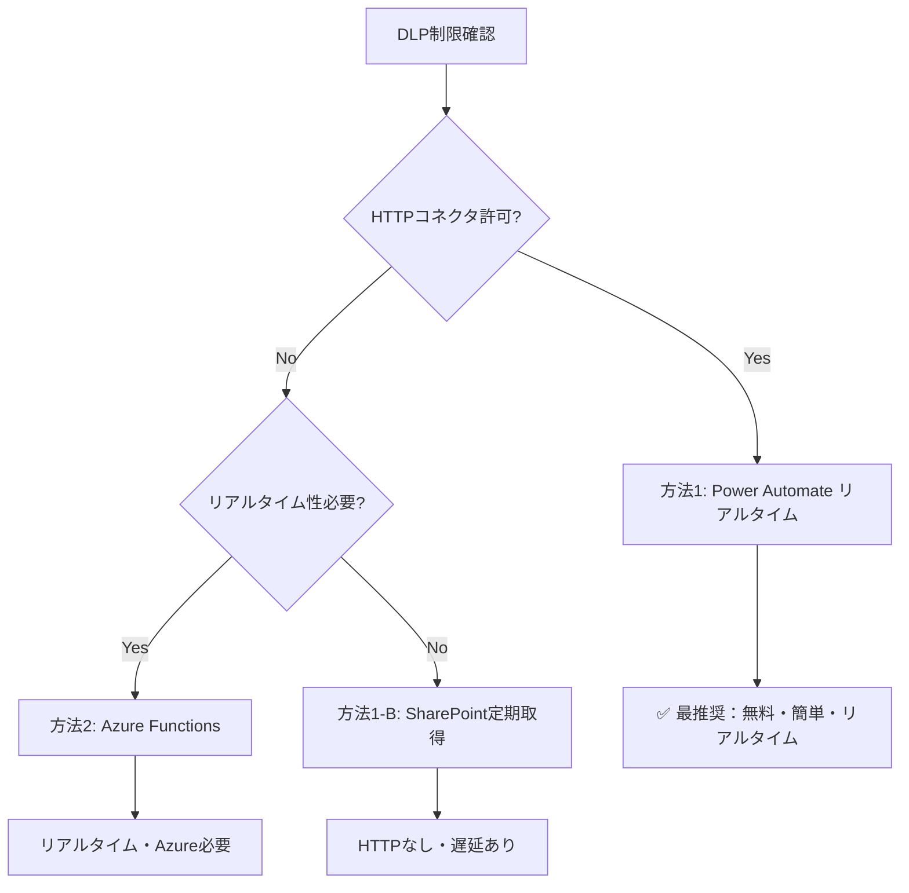

# DLP制限回避のための統合セットアップ手順書

このドキュメントでは、Copilot StudioでDLP（データ損失防止）ポリシーによりカスタムコネクタが制限されている場合の、Microsoft製品を使用した代替統合方法を説明します。

## 目次

- [概要](#概要)
- [前提条件](#前提条件)
- [方法1: Power Automate リアルタイム呼び出し（完全無料・最推奨）](#方法1-power-automate-リアルタイム呼び出し完全無料最推奨)
- [方法1-B: SharePoint定期取得方式（従来型）](#方法1-b-sharepoint定期取得方式従来型)
- [方法2: Azure Functions統合](#方法2-azure-functions統合)
- [方法3: Power Automate Standard（HTTP許可時）](#方法3-power-automate-standardhttp許可時)
- [トラブルシューティング](#トラブルシューティング)
- [まとめ](#まとめ)

---

## 概要

### DLP制限の問題

会社のCopilot StudioでカスタムコネクタがDLPポリシーにより禁止されている場合、以下のMicrosoft純正サービスを使った代替統合方法を提供します。

### 代替方法の比較

| 方法 | 月額コスト | DLP承認 | 実装難易度 | リアルタイム性 | HTTP必要 |
|------|-----------|---------|-----------|-------------|----------|
| 方法1: Power Automate リアルタイム | ¥0 | ✅ 最高 | ⭐ 易 | ⚡ リアルタイム | ✅ 必要 |
| 方法1-B: SharePoint 定期取得 | ¥0 | ✅ 最高 | ⭐⭐ 中 | 準リアルタイム（1-5分） | ❌ 不要 |
| 方法2: Azure Functions | ¥0〜数百円 | ✅ 高 | ⭐⭐ 中 | ⚡ リアルタイム | ❌ 不要 |
| 方法3: Power Automate (直接) | ¥0 | ⚠️ 要確認 | ⭐ 易 | ⚡ リアルタイム | ✅ 必要 |

---

## 前提条件

### 共通の前提条件

- ✅ **Microsoft 365ライセンス**（Business Standard以上）
- ✅ **Copilot Studioライセンス**
- ✅ **PLC Gateway APIサーバーが稼働中**
- ✅ **Power Platform環境へのアクセス権**

### PLC Gateway APIサーバーの起動確認

```bash
# サーバーディレクトリへ移動
cd d:\dev\gateway

# サーバー起動
python main.py --rest-api

# 動作確認
curl "http://localhost:8000/api/version"
```

**期待される出力**:
```json
{
  "version": "1.2.0",
  "status": "running"
}
```

---

## 方法1: Power Automate リアルタイム呼び出し（完全無料・最推奨）

### ⚡ 概要

```
Copilot Studio（ユーザーリクエスト） → Power Automate（即時実行） → PLC Gateway API → レスポンス返却
```

**最大のメリット**:
- ✅ **完全無料**（M365ライセンスに含まれる）
- ✅ **リアルタイム応答**（通常2-5秒、最大100秒制限）
- ✅ **DLP承認確実**（Power Automateフローは標準機能）
- ✅ **追加承認不要**
- ✅ **実装が最も簡単**

**⚡ 実際の応答時間**:
- PLC Gateway APIのレスポンス: **1秒未満**
- Power Automateの処理オーバーヘッド: **1-3秒**
- **合計**: 通常**2-5秒**程度で完了（体感的に十分リアルタイム）
- ※ 100秒はMicrosoftの制限値であり、実際の処理時間ではありません

**⚠️ 前提条件**:
- HTTPコネクタが環境で許可されている必要があります
- 許可されていない場合は、[方法1-B: SharePoint定期取得方式](#方法1-b-sharepoint定期取得方式従来型) を使用してください

### ステップ1: Power Automateフローの作成（リアルタイム対応）

#### 1-1. 新しいインスタントフローを作成

1. **Power Automate**（https://make.powerautomate.com/）にアクセス
2. **作成** → **インスタント クラウド フロー** を選択
3. フロー名: `PLC単一デバイス読み取り`
4. トリガー: **Copilot からフローを実行する** を選択
5. **作成**をクリック

#### 1-2. 入力パラメータを追加

1. **Copilot からフローを実行する** トリガーをクリック
2. **入力の追加** → 以下のパラメータを追加：

| パラメータ名 | 型 | 必須 | 説明 |
|------------|-----|------|------|
| `device` | テキスト | ✅ | デバイス種別（D, M, X等） |
| `addr` | 数値 | ✅ | デバイスアドレス |
| `length` | 数値 | ❌ | 読み取り長（既定値: 1） |
| `plc_host` | テキスト | ❌ | PLCホスト名またはIP |

**設定例**:
- **device**: 説明「デバイス種別（D, W, R, ZR, X, Y, M）」
- **addr**: 説明「デバイスアドレス（10進数または16進数）」
- **length**: 説明「読み取り長（省略時は1）」
- **plc_host**: 説明「PLCのIPアドレスまたはホスト名（省略時は環境変数）」

#### 1-3. HTTP要求アクションを追加

**⚠️ 注意**: このステップは、環境でHTTPコネクタが許可されている場合のみ実行できます。

1. **新しいステップ** → **HTTP** を検索
2. **HTTP** アクションを選択
3. 以下の設定を入力：

| 項目 | 値 |
|------|-----|
| **メソッド** | `POST` |
| **URI** | `http://<サーバーIP>:8000/api/read` |
| **ヘッダー** | `Content-Type: application/json` |
| **本文** | 下記のJSON参照 |

**本文（Body）**:
```json
{
  "device": "@{triggerBody()['text']}",
  "addr": @{triggerBody()['number']},
  "length": @{if(empty(triggerBody()['number_1']), 1, triggerBody()['number_1'])},
  "plc_host": "@{if(empty(triggerBody()['text_1']), '192.168.1.100', triggerBody()['text_1'])}"
}
```

**重要**: `<サーバーIP>` を実際のPLC Gateway APIサーバーのIPアドレスに変更してください。

#### 1-4. JSON解析アクションを追加

1. **新しいステップ** → **データ操作** → **JSON の解析**
2. **コンテンツ**: `body('HTTP')` を選択
3. **スキーマ**: 以下を貼り付け

```json
{
  "type": "object",
  "properties": {
    "success": {"type": "boolean"},
    "device": {"type": "string"},
    "addr": {"type": "integer"},
    "value": {
      "type": "array",
      "items": {"type": "integer"}
    },
    "error": {"type": "string"}
  }
}
```

#### 1-5. Copilot に応答を返す

1. **新しいステップ** → **エージェントに応答する** を検索
2. **エージェントに応答する** アクションを選択
3. **出力の追加**:

| 出力名 | 型 | 値 |
|--------|-----|-----|
| `success` | はい/いいえ | `body('JSON_の解析')?['success']` |
| `device` | テキスト | `body('JSON_の解析')?['device']` |
| `addr` | 数値 | `body('JSON_の解析')?['addr']` |
| `value` | テキスト | `string(body('JSON_の解析')?['value'])` |
| `error` | テキスト | `body('JSON_の解析')?['error']` |

**重要設定**:
- **エージェントに応答する** アクション内の **設定**（3点メニュー） → **ネットワーク** を開く
- **非同期応答**: `オフ` に設定（リアルタイム応答のため必須）

#### 1-6. フローの保存とテスト

1. 右上の **保存** をクリック
2. **テスト** → **手動** → **テスト**
3. パラメータを入力して動作確認:
   - device: `D`
   - addr: `100`
   - length: `1`
   - plc_host: `192.168.1.100`

**期待される出力**:
```json
{
  "success": true,
  "device": "D",
  "addr": 100,
  "value": "[12345]"
}
```

### ステップ2: Copilot Studioでフローを呼び出す

#### 2-1. トピックの作成

1. **Copilot Studio**（https://copilotstudio.microsoft.com/）にアクセス
2. 対象のエージェントを開く
3. **トピック** タブ → **+ 追加** → **トピック** → **空白から**
4. トピック名: `PLCデバイス読み取り`

#### 2-2. トリガーフレーズの設定

**トリガー** ノードに以下のフレーズを追加：

- "D100の値を読み取って"
- "デバイスD100の値は？"
- "データレジスタ100番を教えて"
- "M200の状態を確認"
- "PLCのD100を取得"

#### 2-3. 質問ノードでデバイス情報を取得（オプション）

ユーザーから動的にデバイス情報を取得する場合：

1. **質問** ノードを追加
2. 質問文: "どのデバイスを読み取りますか？（例: D100）"
3. **識別**: エンティティ「テキスト」を選択
4. 変数に保存: `deviceSpec`

#### 2-4. アクションでPower Automateフローを呼び出す

1. **アクションを呼び出す** ノードを追加
2. **フローを作成する** をクリック
   - または既存のフロー `PLC単一デバイス読み取り` を選択
3. 入力パラメータを設定:

| パラメータ | 値 | 説明 |
|-----------|-----|------|
| `device` | `"D"` | 固定値、または変数から抽出 |
| `addr` | `100` | 固定値、または変数から抽出 |
| `length` | `1` | （オプション） |
| `plc_host` | `"192.168.1.100"` | （オプション） |

**動的な値を使用する場合**:
- デバイス種別: `substring(Topic.deviceSpec, 0, 1)`
- アドレス: `int(substring(Topic.deviceSpec, 1, length(Topic.deviceSpec)-1))`

#### 2-5. 応答メッセージを表示

1. **メッセージ** ノードを追加
2. 以下のテキストを入力:

```
デバイス {System.Flow.device} (アドレス: {System.Flow.addr}) の値を取得しました。

値: {System.Flow.value}
状態: {if(System.Flow.success, "✅ 成功", "❌ 失敗")}
{if(not(System.Flow.success), concat("エラー: ", System.Flow.error), "")}
```

#### 2-6. 動作確認

1. 右上の **保存** をクリック
2. **テスト** をクリック
3. テストチャットで以下を試す:
   - "D100の値を読み取って"
   - "デバイスD100の値は？"

**期待される応答**:
```
デバイス D (アドレス: 100) の値を取得しました。

値: [12345]
状態: ✅ 成功
```

### ステップ3: バッチ読み取りフローの作成（オプション）

複数デバイスを一括で読み取りたい場合：

#### 3-1. バッチ読み取りフローの作成

1. **Power Automate** → **作成** → **インスタント クラウド フロー**
2. フロー名: `PLC複数デバイス一括読み取り`
3. トリガー: **Copilot からフローを実行する**

#### 3-2. 入力パラメータ

| パラメータ名 | 型 | 必須 | 説明 |
|------------|-----|------|------|
| `devices` | テキスト | ✅ | カンマ区切りデバイスリスト（例: "D100,M200,X1A"） |
| `plc_host` | テキスト | ❌ | PLCホスト名またはIP |

#### 3-3. HTTP要求（バッチ読み取り）

**URI**: `http://<サーバーIP>:8000/api/batch_read`

**本文**:
```json
{
  "devices": @{split(triggerBody()['text'], ',')},
  "plc_host": "@{if(empty(triggerBody()['text_1']), '192.168.1.100', triggerBody()['text_1'])}"
}
```

#### 3-4. エージェントに応答を返す

**出力**:
- `success`: はい/いいえ
- `results`: テキスト（JSON文字列）

#### 3-5. Copilot Studioでの使用

**トピック**: `PLC複数デバイス読み取り`

**トリガーフレーズ**:
- "D100とM200とX1Aを一括で読み取って"
- "複数のデバイスを取得したい"

**フロー呼び出し**:
- devices: `"D100,M200,X1A"` （または動的に取得）

---

## 方法1-B: SharePoint定期取得方式（従来型）

### 📊 概要

HTTPコネクタがDLPでブロックされている場合の代替方法です。

```
PLC Gateway API → Power Automate（定期実行） → SharePoint リスト → Copilot Studio
```

**メリット**:
- ✅ **HTTPコネクタ不要**（SharePointのみ使用）
- ✅ **完全無料**
- ✅ **DLP承認確実**

**デメリット**:
- ⚠️ **準リアルタイム**（1-5分遅延）
- ⚠️ **定期実行のみ**

### 実装手順

詳細は割愛しますが、基本的な流れ：

1. SharePointリストを作成（デバイス名、値、タイムスタンプ等の列）
2. Power Automateでスケジュール実行フローを作成（5分ごと等）
3. HTTPアクションでPLC Gateway APIからデータ取得
4. SharePointリストに書き込み
5. Copilot StudioでSharePointコネクタを使用してリストから読み取り

**注意**: この方式はリアルタイム性が低いため、**方法1（リアルタイム呼び出し）が使用できない場合のみ**推奨します。

---

## 方法2: Azure Functions統合

### ⚡ 概要

```
PLC Gateway API → Azure Functions → Copilot Studio（Azure Functionsコネクタ）
```

**メリット**:
- ✅ **リアルタイム応答**
- ✅ **サーバーレス**（運用コスト低）
- ✅ **月間100万回実行まで無料**
- ✅ **Azure Functionsコネクタは承認されやすい**

### ステップ1: Azure Functionsの作成

#### 1-1. Azureポータルにアクセス

1. **Azure Portal**（https://portal.azure.com/）にログイン
2. **リソースの作成** → **関数アプリ** を検索
3. **作成** をクリック

#### 1-2. 関数アプリの設定

| 項目 | 値 |
|------|-----|
| **サブスクリプション** | 使用するサブスクリプションを選択 |
| **リソースグループ** | 新規作成: `rg-plc-gateway` |
| **関数アプリ名** | `func-plc-gateway-<ユニーク名>` |
| **公開** | `コード` |
| **ランタイムスタック** | `Python` |
| **バージョン** | `3.9`以上 |
| **地域** | `Japan East`（または最寄りのリージョン） |
| **オペレーティングシステム** | `Linux` |
| **プランの種類** | `従量課金（サーバーレス）` |

**作成**をクリックして、デプロイ完了を待つ（数分）。

#### 1-3. 関数の作成

1. デプロイ完了後、**リソースに移動**
2. 左メニュー **関数** → **作成**
3. 開発環境: **ポータルでの開発**
4. テンプレート: **HTTP trigger**
5. 関数名: `ReadPLCDevice`
6. 承認レベル: **Function**
7. **作成**をクリック

### ステップ2: 関数コードの実装

#### 2-1. コードエディタを開く

1. 作成した関数 `ReadPLCDevice` をクリック
2. 左メニュー **コードとテスト** を選択

#### 2-2. コードを記述

`__init__.py` の内容を以下に置き換え：

```python
import logging
import json
import requests
import azure.functions as func

def main(req: func.HttpRequest) -> func.HttpResponse:
    logging.info('PLC Device Read function triggered')

    # リクエストパラメータ取得
    try:
        req_body = req.get_json()
    except ValueError:
        return func.HttpResponse(
            "Invalid JSON body",
            status_code=400
        )

    # パラメータ検証
    device = req_body.get('device')
    addr = req_body.get('addr')
    length = req_body.get('length', 1)
    plc_host = req_body.get('plc_host', '192.168.1.100')  # デフォルトPLC IP

    if not device or addr is None:
        return func.HttpResponse(
            json.dumps({
                "success": False,
                "error": "Missing required parameters: device, addr"
            }),
            status_code=400,
            mimetype="application/json"
        )

    # PLC Gateway APIを呼び出し
    gateway_url = "http://<Gateway-Server-IP>:8000/api/read"  # ← 実際のIPに変更

    try:
        response = requests.post(
            gateway_url,
            json={
                "device": device,
                "addr": addr,
                "length": length,
                "plc_host": plc_host
            },
            timeout=5
        )

        response.raise_for_status()
        result = response.json()

        return func.HttpResponse(
            json.dumps(result),
            status_code=200,
            mimetype="application/json"
        )

    except requests.exceptions.RequestException as e:
        logging.error(f"Failed to call PLC Gateway API: {str(e)}")
        return func.HttpResponse(
            json.dumps({
                "success": False,
                "error": f"Gateway API error: {str(e)}"
            }),
            status_code=500,
            mimetype="application/json"
        )
```

**重要**: `<Gateway-Server-IP>` を実際のPLC Gateway APIサーバーのIPアドレスに変更してください。

#### 2-3. requirements.txtの更新

1. 左メニュー **アプリファイル** を選択
2. **requirements.txt** を選択
3. 以下を追加：

```txt
azure-functions
requests
```

4. **保存**をクリック

### ステップ3: 関数のテスト

#### 3-1. テスト実行

1. **コードとテスト** 画面で **テスト/実行** をクリック
2. **入力** タブで以下を設定：

**HTTPメソッド**: `POST`

**本文**:
```json
{
  "device": "D",
  "addr": 100,
  "length": 1,
  "plc_host": "192.168.1.100"
}
```

3. **実行** をクリック
4. **出力** タブでレスポンスを確認

**期待される出力**:
```json
{
  "success": true,
  "device": "D",
  "addr": 100,
  "value": [12345]
}
```

#### 3-2. 関数URLの取得

1. **関数** → **ReadPLCDevice** を選択
2. 上部メニュー **関数のURLの取得** をクリック
3. URLをコピー（例: `https://func-plc-gateway-xxx.azurewebsites.net/api/ReadPLCDevice?code=xxx`）

### ステップ4: Copilot StudioでAzure Functionsコネクタを設定

#### 4-1. カスタムコネクタの作成

1. **Power Platform**（https://make.powerapps.com/）にアクセス
2. 左メニュー **データ** → **カスタムコネクタ**
3. **新しいカスタムコネクタ** → **一から作成**

#### 4-2. 一般情報

| 項目 | 値 |
|------|-----|
| **コネクタ名** | `PLC Gateway via Azure Functions` |
| **ホスト** | `func-plc-gateway-xxx.azurewebsites.net` |
| **ベースURL** | `/api` |

**続行**をクリック

#### 4-3. セキュリティ

1. **認証の種類**: `APIキー`
2. **パラメータラベル**: `code`
3. **パラメータ名**: `code`
4. **パラメータの場所**: `クエリ`

**続行**をクリック

#### 4-4. 定義（アクション作成）

1. **新しいアクション** をクリック
2. **概要**:

| 項目 | 値 |
|------|-----|
| **概要** | PLCデバイス読み取り |
| **説明** | PLCデバイスから値を読み取ります |
| **操作ID** | `ReadPLCDevice` |

3. **要求** セクション:
   - **インポート元**: サンプル
   - **動詞**: `POST`
   - **URL**: `https://func-plc-gateway-xxx.azurewebsites.net/api/ReadPLCDevice`
   - **本文**:
   ```json
   {
     "device": "D",
     "addr": 100,
     "length": 1,
     "plc_host": "192.168.1.100"
   }
   ```
   - **インポート**をクリック

4. **応答** セクション:
   - **既定の応答を追加**
   - サンプルレスポンス:
   ```json
   {
     "success": true,
     "device": "D",
     "addr": 100,
     "value": [12345]
   }
   ```

5. 右上の **コネクタの作成** をクリック

#### 4-5. テスト

1. **テスト** タブを選択
2. **新しい接続** をクリック
3. Azure Functionsの `code` パラメータ値を入力
4. **テスト操作** で動作確認

#### 4-6. Copilot Studioで使用

1. Copilot Studioでエージェントを開く
2. **ツール** → **カスタムコネクタ**
3. `PLC Gateway via Azure Functions` を追加
4. トピックで使用

---

## 方法3: Power Automate Standard（HTTP許可時）

### 📡 概要

```
Copilot Studio → Power Automate（クラウドフロー） → PLC Gateway API
```

**前提条件**:
- ⚠️ **環境でHTTPコネクタが許可されている必要があります**

### ステップ1: Power Automateフローの作成

#### 1-1. 新しいフローを作成

1. **Power Automate**（https://make.powerautomate.com/）にアクセス
2. **作成** → **インスタントクラウドフロー**
3. フロー名: `PLC単一デバイス読み取り`
4. トリガー: **Power Virtual Agents**（Copilot Studio）
5. **作成**をクリック

#### 1-2. 入力パラメータを追加

1. **Power Virtual Agents** トリガーを選択
2. **入力の追加**:

| パラメータ名 | 型 | 必須 |
|------------|-----|------|
| `device` | テキスト | ✅ |
| `addr` | 数値 | ✅ |
| `length` | 数値 | ❌ |
| `plc_host` | テキスト | ❌ |

#### 1-3. HTTP要求アクションを追加

1. **新しいステップ** → **HTTP** を検索
2. 以下の設定:

| 項目 | 値 |
|------|-----|
| **メソッド** | `POST` |
| **URI** | `http://<サーバーIP>:8000/api/read` |
| **ヘッダー** | `Content-Type: application/json` |
| **本文** | 下記参照 |

**本文**:
```json
{
  "device": "@{triggerBody()['text']}",
  "addr": @{triggerBody()['number']},
  "length": @{if(empty(triggerBody()['number_1']), 1, triggerBody()['number_1'])},
  "plc_host": "@{if(empty(triggerBody()['text_1']), '192.168.1.100', triggerBody()['text_1'])}"
}
```

#### 1-4. レスポンスを返す

1. **新しいステップ** → **Power Virtual Agentsに値を返す**
2. **出力の追加**:

| 出力名 | 型 | 値 |
|--------|-----|-----|
| `success` | はい/いいえ | `@{body('HTTP')['success']}` |
| `value` | テキスト | `@{body('HTTP')['value']}` |
| `error` | テキスト | `@{body('HTTP')['error']}` |

3. **保存**をクリック

### ステップ2: Copilot Studioでフローを呼び出す

#### 2-1. トピックの作成

1. Copilot Studioで新しいトピック作成
2. トリガーフレーズ: "D100の値を読み取って"

#### 2-2. アクションでフローを呼び出す

1. **アクションを呼び出す** ノードを追加
2. **Power Automate** → `PLC単一デバイス読み取り` を選択
3. 入力:
   - `device`: "D"
   - `addr`: 100
   - `length`: 1
   - `plc_host`: （空白または変数）

#### 2-3. レスポンスを表示

1. **メッセージ** ノードを追加
2. テキスト:
```
デバイス値: {x.value}
状態: {if(x.success, '成功', '失敗')}
```

#### 2-4. テスト

1. テストチャットで動作確認
2. "D100の値を読み取って" と入力
3. 正常に値が返されることを確認

---

## トラブルシューティング

### 問題1: HTTPコネクタがDLPでブロックされる

**症状**:
```
Error: Connector 'HTTP' is blocked by DLP policy
```

**解決策**:
1. ✅ **方法1（SharePoint + 定期実行）**を使用
2. ✅ **方法2（Azure Functions経由）**を使用
3. IT部門に特定エンドポイントのみ許可を依頼

### 問題2: Azure Functionsからゲートウェイに接続できない

**症状**:
```
Gateway API error: Connection timeout
```

**解決策**:
1. Gateway APIサーバーがパブリックIPで公開されているか確認
2. Azure Functionsからアクセスできるネットワーク構成か確認
3. ファイアウォール設定を確認
4. 代替案: **Azure VNet統合**を使用

### 問題3: Power Automateフローが100秒以内に完了しない

**症状**:
```
Error: Flow execution timeout
The flow did not respond within the 100 second limit
```

**解決策**:
1. ✅ PLC Gateway APIのレスポンス時間を確認
2. ✅ 不要なアクションを削減
3. ✅ タイムアウト設定を最適化
4. ✅ バッチ読み取りの場合、デバイス数を減らす

### 問題4: 「非同期応答」がオンになっている

**症状**:
- フローは実行されるが、Copilot Studioに値が返ってこない

**解決策**:
1. ✅ **エージェントに応答する** アクションを開く
2. ✅ 3点メニュー → **設定** → **ネットワーク**
3. ✅ **非同期応答**: `オフ` に設定
4. ✅ フローを保存

### 問題5: SharePointリストのデータが更新されない（方法1-B使用時）

**症状**:
- Power Automateフローが失敗している
- データが古いまま

**解決策**:
1. Power Automateのフロー実行履歴を確認
2. HTTP要求のURLが正しいか確認
3. PLC Gateway APIサーバーのログを確認
4. SharePointリストの権限を確認

### 問題4: Copilot Studioがツールを呼び出さない

**症状**:
- 質問してもツールが実行されない

**解決策**:
1. ツールの説明を詳細に記述
2. トリガーフレーズを追加
3. トピックの条件を確認
4. デバッグモードで動作確認

### 問題5: Azure Functionsのコストが心配

**解決策**:
1. **無料枠の確認**:
   - 月間100万回の実行無料
   - 400,000 GB秒の実行時間無料
2. **コスト監視**:
   - Azureポータルで「コスト管理」を確認
   - アラートを設定
3. **最適化**:
   - 不要なログ出力を削減
   - タイムアウト時間を短縮

---

## まとめ

### 推奨フロー



### 各方法の選択基準

| 要件 | 推奨方法 |
|------|----------|
| **HTTPコネクタ許可 + リアルタイム** | 方法1: Power Automate リアルタイム（最推奨） |
| **HTTPコネクタ禁止 + リアルタイム** | 方法2: Azure Functions |
| **HTTPコネクタ禁止 + 遅延OK** | 方法1-B: SharePoint定期取得 |
| **完全無料** | 方法1 または 方法1-B |
| **中規模利用（数千回/日）** | 方法1 または 方法2 |
| **Azure使用不可** | 方法1 または 方法1-B |

### 成功のポイント

✅ **IT部門との連携**: DLPポリシーの理解と調整
✅ **段階的実装**: まず方法1で動作確認、必要に応じて方法2へ
✅ **監視体制**: 各サービスのログとエラーを定期確認
✅ **ドキュメント化**: 構成図と設定内容を記録

---

## 参考リンク

- [Power Automate公式ドキュメント](https://learn.microsoft.com/ja-jp/power-automate/)
- [Azure Functions クイックスタート](https://learn.microsoft.com/ja-jp/azure/azure-functions/create-first-function-vs-code-python)
- [SharePoint リスト操作ガイド](https://support.microsoft.com/ja-jp/office/sharepoint-lists)
- [Power Platform DLP ポリシー](https://learn.microsoft.com/ja-jp/power-platform/admin/wp-data-loss-prevention)
- [PLC Gateway API - Copilot Studio統合](./COPILOT_STUDIO_SETUP.md)

---

**最終更新日**: 2025-01-20
**バージョン**: 1.0.0
**作成者**: PLC Gateway Development Team
